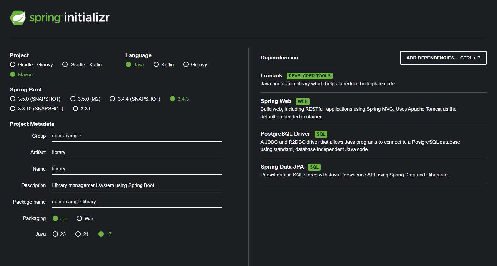

# Отчёт по лабораторной работе

## **Разработка Spring Boot приложения для управления библиотекой**

### **Задача**
Разработать Spring Boot приложение для управления библиотекой, где будут 3 контроллера, 3 сервиса и 5 взаимосвязанных сущностей.

API должно работать с DTO, а не с entity.

## **Структура базы данных**
### **1. Сущности**
- **Author** (один автор может написать много книг)
- **Publisher** (один издатель может издать много книг)
- **Book** (принадлежит одному автору, одному издателю, может относиться к нескольким категориям)
- **Category** (одна категория может относиться к нескольким книгам)
- **Library** (библиотека содержит коллекцию книг)

## **Запуск проекта**
### **1. используя скрипт**
```bash
sudo ./build.sh
```
### **2. Сборка и запуск в Docker**
```bash
docker-compose up --build -d
```

### **3. Запуск API тестов**
```bash
./testapi.sh
```

Практическая часть

### Генерация проекта через spring initialzr:


Подключаемые зависимости:
 - Spring Web – добавляет модуль для обработки HTTP-запросов и формирования JSON-ответов (используется в контроллерах).
 - JPA – включает Hibernate, ORM для работы с базой данных. Позволяет взаимодействовать с БД через репозитории без написания SQL-запросов.
 - PostgreSQL Driver – необходим для подключения к базе данных PostgreSQL.
 - Lombok – уменьшает количество шаблонного кода.

---

Успешно развернута база данных PostgreSQL в Docker и конфигурационный файл (docker-compose), в котором описан сервис PostgreSQL.
```yaml
services:
  database:
    image: postgres:15
    container_name: library_db
    restart: always
    environment:
      POSTGRES_DB: library_db
      POSTGRES_USER: librarydbuser
      POSTGRES_PASSWORD: 1234
    ports:
      - "5432:5432"
    volumes:
      - postgres_data:/var/lib/postgresql/data
    healthcheck:
      test: ["CMD-SHELL", "pg_isready -U librarydbuser -d library_db || exit 1"]
      interval: 5s
      timeout: 5s
      retries: 5
```


Файл docker-compose.yml предназначен для развертывания сервиса базы данных PostgreSQL в контейнере Docker.

 - services: database – создается сервис с именем database, использующий образ postgres:15.
 - container_name: library_db – задает имя контейнера.
 - restart: always – автоматически перезапускает контейнер в случае сбоя.
 - environment – определяет переменные окружения для конфигурации базы данных:
 - POSTGRES_DB: library_db – имя создаваемой БД.
 - POSTGRES_USER: librarydbuser – имя пользователя.
 - POSTGRES_PASSWORD: 1234 – пароль для подключения.
 - ports: "5432:5432" – пробрасывает порт контейнера PostgreSQL на хостовую машину.
 - volumes: postgres_data:/var/lib/postgresql/data – сохраняет данные БД между перезапусками контейнера.
 - healthcheck – проверяет доступность БД командой pg_isready, повторяя попытки каждые 5 секунд.
Этот конфигурационный файл позволяет быстро развернуть PostgreSQL в Docker с сохранением данных и механизмом проверки работоспособности.

---

В `application.properties` происходит подключение к БД следующим образом 
```
# Подключение к PostgreSQL
spring.datasource.url=jdbc:postgresql://database:5432/library_db
spring.datasource.username=librarydbuser
spring.datasource.password=1234
spring.datasource.driver-class-name=org.postgresql.Driver
```
---

### Создание сущностей

Для организации кода создаем отдельный пакет entities, в котором будем описывать классы-сущности и их свойства.
Пример сущность Author.
```Java
package com.example.library.entity;

import jakarta.persistence.*;
import lombok.Getter;
import lombok.Setter;
import ```java.util.List;

@Entity // Делаем класс сущностью для базы данных
@Getter @Setter // Автоматически создаёт геттеры, сеттеры и конструктор без аргументов
public class Author {
    @Id // Это PRIMARY KEY
    @GeneratedValue(strategy = GenerationType.IDENTITY) // Автоинкремент ID
    private Long id;

    private String name;

    @OneToMany(mappedBy = "author", cascade = CascadeType.ALL) // Связь "один ко многим"
    private List<Book> books; // Один автор может написать много книг
    
    public Author() {} //  Пустой конструктор (нужен JPA)

    public Author(String name) { //  Добавленный конструктор
        this.name = name;
    }
}
```
`@Entity` - аннотация, указывающая, что это сущность для БД

`@GeneratedValue(strategy = GenerationType.IDENTITY)` - автогенерация Id по мере создания авторов в бд

---

### Создание DTO
Для передачи данных между слоями приложения создаем пакет dto, в котором будут находиться классы DTO.
Пример класса `BookDTO`
```java
package com.example.library.dto;

import lombok.Getter;
import lombok.NoArgsConstructor;
import lombok.Setter;
import ```java.util.Set;

@Getter
@Setter
@NoArgsConstructor
public class BookDTO {
    private Long id;
    private String title;
    private String authorName;
    private String publisherName;
    private Set<String> categories;

    public BookDTO(Long id, String title, String authorName, String publisherName, Set<String> categories) {
        this.id = id;
        this.title = title;
        this.authorName = authorName;
        this.publisherName = publisherName;
        this.categories = categories;
    }
}
```

---

### Создание репозиториев

Репозитории нужны для работы с БД без использования SQL скриптов. 

Пример:

```java
package com.example.library.repository;
import com.example.library.entity.Book;
import org.springframework.data.jpa.repository.JpaRepository;


// спринг автоматически создает следующие методы:
// save(T entity)	Сохраняет или обновляет объект в базе
// findById(ID id)	Ищет объект по id
// findAll()	Возвращает все записи
// deleteById(ID id)	Удаляет объект по id
// existsById(ID id)	Проверяет, существует ли объект по id
// count()	Возвращает количество записей в таблице


public interface BookRepository extends JpaRepository<Book, Long> {

}
```

---

### Создание сервисов
Сервис (Service) в Spring Boot – это слой приложения, который содержит бизнес-логику и отвечает за обработку данных, полученных из репозиториев. Он служит промежуточным звеном между контроллерами и базой данных.

Пример сервиса BookService
```java
@Service
public class BookService {
    private final BookRepository bookRepository;
    private final AuthorRepository authorRepository;
    private final PublisherRepository publisherRepository;
    private final CategoryRepository categoryRepository;
    private final LibraryRepository libraryRepository;

    public BookService(BookRepository bookRepository, AuthorRepository authorRepository,
                       PublisherRepository publisherRepository, CategoryRepository categoryRepository,
                       LibraryRepository libraryRepository) {
        this.bookRepository = bookRepository;
        this.authorRepository = authorRepository;
        this.publisherRepository = publisherRepository;
        this.categoryRepository = categoryRepository;
        this.libraryRepository = libraryRepository;
    }
}
```
Аннотация `@Service` обозначает, что данный класс является сервисом, который управляется Spring и может быть внедрен в другие компоненты.
Через конструктор внедряются репозитории (BookRepository, AuthorRepository, и т. д.), которые позволяют работать с БД.

### Основные методы сервиса

#### Получение всех книг


Метод `getAllBooks()` загружает все книги из базы и преобразует их в DTO-объекты.

```java
public List<BookDTO> getAllBooks() {
    return bookRepository.findAll().stream()
            .map(this::convertToDTO)
            .collect(Collectors.toList());
}
```
 - Используется `stream()` и `map()`, чтобы преобразовать список сущностей Book в BookDTO.

#### Получение книги по ID


Метод `getBookById(Long id)` ищет книгу в базе данных.

```java
public BookDTO getBookById(Long id) {
    return bookRepository.findById(id)
            .map(this::convertToDTO)
            .orElseThrow(() -> new RuntimeException("Книга не найдена"));
}
```
 - Используется Optional и orElseThrow(), чтобы выбросить исключение, если книга не найдена.

#### Создание книги


Метод `createBook(BookDTO bookDTO)` сохраняет новую книгу в базе.

```java
@Transactional
public BookDTO createBook(BookDTO bookDTO) {
    addBookToLibrary(bookDTO.getTitle());
    return convertToDTO(bookRepository.save(convertToEntity(bookDTO)));
}
```
 - Аннотация `@Transactional`

Обеспечивает атомарность операции, предотвращая частичное сохранение данных при сбоях.
 - Вызов `convertToEntity()`

Метод конвертирует BookDTO в Book, создавая при необходимости новые сущности (автор, издатель, категории).

#### Обновление книги


Метод `updateBook(Long id, BookDTO bookDTO)` обновляет существующую книгу.

```java
@Transactional
public BookDTO updateBook(Long id, BookDTO bookDTO) {
    return bookRepository.findById(id)
            .map(existingBook -> {
                existingBook.setTitle(bookDTO.getTitle());
                return convertToDTO(bookRepository.save(existingBook));
            })
            .orElseThrow(() -> new RuntimeException("Книга не найдена"));
}
```
 - Сначала проверяется, есть ли книга в базе. Если да – обновляется ее название.

#### Удаление книги


Метод `deleteBook(Long id)` удаляет книгу по ID.

```java
public void deleteBook(Long id) {
    if (!bookRepository.existsById(id)) {
        throw new RuntimeException("Книга не найдена");
    }
    bookRepository.deleteById(id);
}
```
 - Сначала проверяется наличие книги, затем выполняется удаление.

#### Дополнительные методы


 - Преобразование Book ⇄ BookDTO
Эти методы помогают отделить слои представления (DTO) от бизнес-логики (Entity).

```java
private BookDTO convertToDTO(Book book) {
    return new BookDTO(
            book.getId(),
            book.getTitle(),
            book.getAuthor().getName(),
            book.getPublisher().getName(),
            book.getCategories().stream().map(Category::getName).collect(Collectors.toSet())
    );
}

private Book convertToEntity(BookDTO bookDTO) {
    return new Book(
            bookDTO.getTitle(),
            authorRepository.findByName(bookDTO.getAuthorName())
                    .orElseGet(() -> authorRepository.save(new Author(bookDTO.getAuthorName()))),
            publisherRepository.findByName(bookDTO.getPublisherName())
                    .orElseGet(() -> publisherRepository.save(new Publisher(bookDTO.getPublisherName()))),
            bookDTO.getCategories().stream()
                    .map(categoryName -> categoryRepository.findByName(categoryName)
                            .orElseGet(() -> categoryRepository.save(new Category(categoryName))))
                    .collect(Collectors.toSet())
    );
}
```
 - Эти методы позволяют автоматически создавать отсутствующих авторов, издателей и категории.

---

### Контроллеры

Контроллеры отвечают за выволнение http запросов, и общается с сервисом

#### Аннотации контроллера


```java
@RestController
@RequestMapping("/authors")
public class AuthorController {
```
 - `@RestController` – указывает, что этот класс является REST-контроллером, а все его методы возвращают JSON-ответы.

 - `@RequestMapping("/authors")` – задает базовый URL (/authors) для всех методов контроллера.


#### Внедрение сервиса


```java
private final AuthorService authorService;

public AuthorController(AuthorService authorService) {
    this.authorService = authorService;
}
```
 - Сервис AuthorService внедряется через конструктор, что соответствует принципу инверсии зависимостей (Dependency Injection).

#### Методы контроллера


`getAllAuthors()` – обрабатывает `GET /authors`, возвращает список всех авторов. <br>
`createAuthor()` – обрабатывает `POST /authors`, принимает AuthorDTO и создает нового автора. <br>
`getBooksByAuthor()` – обрабатывает `GET /authors/{id}/books`, возвращает список книг указанного автора. <br>

```java
    //GET all authors
    @GetMapping
    public ResponseEntity<List<AuthorDTO>> getAllAuthors() {
        return ResponseEntity.ok(authorService.getAllAuthors());
    }

    //POST create author
    @PostMapping
    public ResponseEntity<AuthorDTO> createAuthor(@RequestBody AuthorDTO authorDTO) {
        return ResponseEntity.ok(authorService.createAuthor(authorDTO));
    }

    //GET books by author
    @GetMapping("/{id}/books")
    public ResponseEntity<List<BookDTO>> getBooksByAuthor(@PathVariable Long id) {
        return ResponseEntity.ok(authorService.getBooksByAuthor(id));
    }
```
